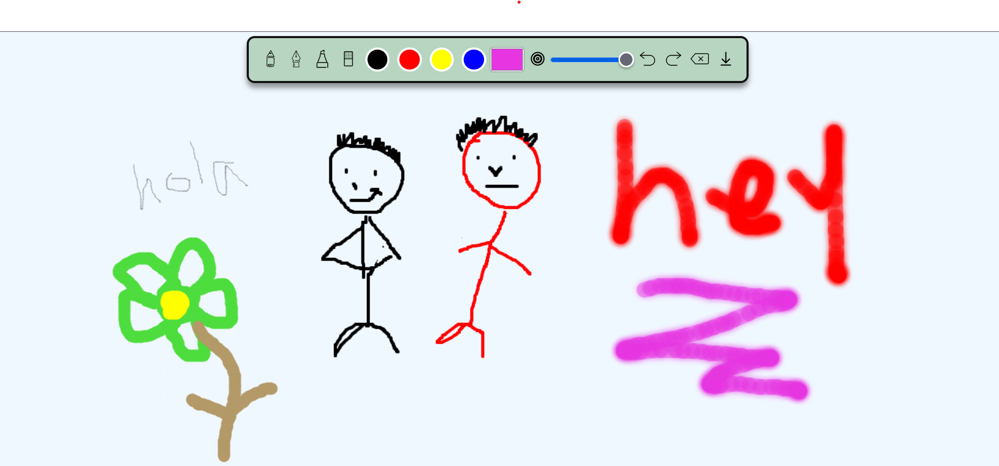

# 🎨 Drawing Web App

This is a simple web-based drawing application that provides various tools for creating digital sketches. It includes a ✏️ pencil, 🖊️ pen, 🖍️ marker, and 🧽 eraser with customizable settings.

## 🌐 Live Demo
You can try out the Drawing Web App live at:
[**Live Demo**](https://yourwebsite.com/drawing-app)

## ✨ Features
- **✏️ Pencil Tool**: Light opacity for a realistic pencil effect.
- **🖊️ Pen Tool**: Smooth, solid strokes for precise drawing.
- **🖍️ Marker Tool**: Layering effect with semi-transparent strokes.
- **🧽 Eraser**: Allows erasing with adjustable size.
- **↩️ Undo/Redo**: Keeps track of up to 15 actions for undo/redo functionality.
- **🗑️ Clear Canvas**: Removes all drawings from the canvas.
- **💾 Download**: Saves the current drawing as a PNG file.
- **🎨 Custom Brush Size and Color**: Allows users to customize stroke thickness and color.
