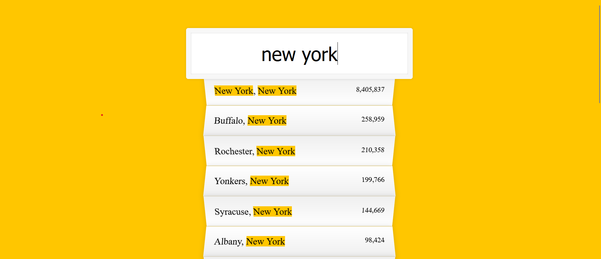

# Type Ahead Search

This folder contains the code for the **Type Ahead Search** mini-project. It implements a search feature where users can filter through cities and states in real-time based on the user input. The search term is highlighted in the results.

## Features:
- **Real-time search**: As the user types, the results update dynamically.
- **Highlight matched terms**: The search term is highlighted in the city and state names for better visibility.
- **Formatted population values**: Populations are displayed with commas for improved readability.

## Files:
- **`index.html`**: The main HTML file for the app.
- **`style.css`**: The styling for the app, including the search input and the result display.
- **`script.js`**: The JavaScript code that implements the search logic and handles the display of matching cities and states.

## Live Demo
You can try out the live demo of the project by visiting [this link](#) 

## Screenshot
Here’s a screenshot of the Type Ahead Search feature in action:

  

